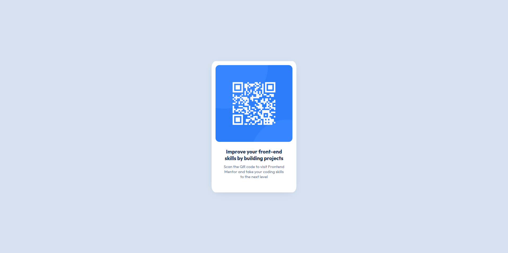

# Frontend Mentor - QR code component solution
## Overview
This is my solution to the qr-code component challenge on frontend mentor. This is my first project after learning the basics of HTML and CSS.

### Screenshot

### What I learned

I learnt how to style the contents of a page using flexbox

## Author

- Quartey Obed Nii Kpakpa
- Frontend Mentor - [@obkpakpa](https://www.frontendmentor.io/profile/obkpakpa)

